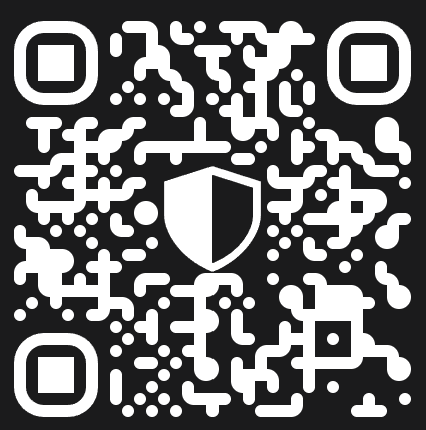

# 🪟 U2RE OS 🪟

- **Demo:** <https://os.u2re.space/>
- **Original:** <https://github.com/unite-2-re/OS.u2re.space>
- **Telegram:** <https://t.me/u2re_space>

---

## Features

I practically done version number one. Frontend-only project.

<table width="100%">
<tr>
<td valign="top">

### What have done?

- Basic settings
- Wallpaper setup
- Dark and light theme
- Workspace grid
- Time in taskbar
- Mobile version
- Window system
- Basic calendar
- Basic file manager
- Workspace item editor
- Quick settings panel
- Basic start menu button
- Chrome extension (experiment)

</td>
<td valign="top">

### What to be planned?

- Documentation
- Hello screens
- Optional backends
- Tooltips (recover)

</td>
</tr>
</table>

---

## About

*U2RE founders reserve rights for any actions with their project... also have rights to apply some local sanctions for users, who have violations with us, or who marked as enemies.*

<table width="100%">
<tr>
<td valign="top">

### Links

- **Demo:** <https://os.u2re.space/>
- **Github:** [OS.u2re.space](https://github.com/unite-2-re/OS.u2re.space)

### Contributors

- None

</td>
<td valign="top">

### Contacts

- [Telegram Group](https://t.me/u2re_space) (`u2re_space`)
- [Email](mailto:c24b@u2re.ru) (`c24b@u2re.ru`)

### Developers

- [U2RE-Dev](https://github.com/u2re-dev) (Github)

</td>
</tr>
</table>

## Projects and deps

*Project that was made by us, or have in dependency with our projects. Here listed most notable.*

<table width="100%">
<tr>
<td valign="top">

### Our

- **[Uniform.TS](https://github.com/unite-2-re/uniform.ts)** - ***unused***, web workers library.
- **[Object.TS](https://github.com/unite-2-re/object.ts)** - our library for reactivity.
- **[BLU.E](https://github.com/unite-2-re/BLU.E)** - our UI/DOM framework or library.
- **[Agate.UX](https://github.com/unite-2-re/agate.ux)** - our layout library or framework.
- **[UI.sys](https://github.com/unite-2-re/ui.system)** - UI elements system (based on Lit).
- ***[Others](https://github.com/orgs/unite-2-re/repositories)*** - all available repositories

</td>
<td valign="top">

### Foreign

- **[Culori](https://github.com/Evercoder/culori)**
- **[Lucide](https://github.com/lucide-icons/lucide)**
- **[JSOX](https://github.com/d3x0r/JSOX)**
- **[Happy-OPFS](https://github.com/JiangJie/happy-opfs.git)**

</td>
</tr>
</table>

## Donation

<table width="100%">
<tr>
<td valign="top">

</td>
<td valign="top">

You may consider about donation for our projects (USDT options available):

**ETH:** [`0x102E317665bBa4B4D2e2317Bf3c48F83FC13F4ec`](#0x102E317665bBa4B4D2e2317Bf3c48F83FC13F4ec)

**TRX:** [`TCXePhsrVb63qymT84KP8cEfGWAb7qCKYJ`](#TCXePhsrVb63qymT84KP8cEfGWAb7qCKYJ)

</td>
</tr>
</table>
